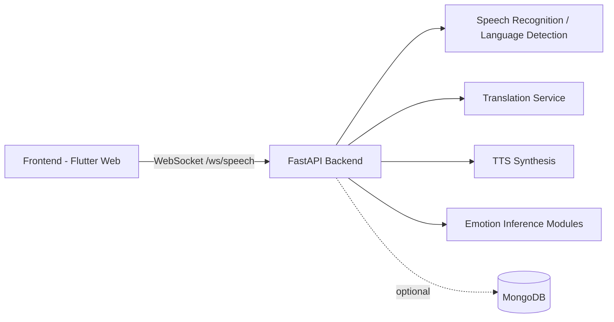

# EmoAI-Translator

[](LICENSE)
[](docker-compose.yml)
[](backend/)
[](frontend/)

Emotion-aware, real-time speech translation for healthcare communication.

EmoAI-Translator is designed to reduce communication barriers between patients and clinicians by combining speech recognition, language translation, text-to-speech synthesis, and emotion-aware context signals. The platform aims to improve clarity, empathy, and trust in multilingual clinical conversations.

## Table of Contents

- [Why This Project](#why-this-project)
- [Core Features](#core-features)
- [How It Works](#how-it-works)
- [Architecture](#architecture)
- [Technology Stack](#technology-stack)
- [Repository Structure](#repository-structure)
- [Installation](#installation)
- [Running the App](#running-the-app)
- [Environment Variables](#environment-variables)
- [Security, Privacy, and HIPAA Awareness](#security-privacy-and-hipaa-awareness)
- [Contribution Guidelines](#contribution-guidelines)
- [Roadmap](#roadmap)
- [Contact](#contact)
- [License](#license)

## Why This Project

Language discordance in healthcare can lead to delays, misunderstandings, and poorer outcomes. Traditional translation tools often miss emotional context, which is critical in sensitive medical discussions.

EmoAI-Translator addresses this by:

- Capturing spoken input in real time
- Detecting speech language and transcribing content
- Translating content for the other participant
- Synthesizing translated speech output
- Incorporating emotion-related inference to support more context-aware communication

## Core Features

- Real-time speech pipeline via WebSocket (`/ws/speech`)
- Automatic speech transcription and language detection
- Multi-language translation workflow for conversational turn-taking
- Text-to-speech synthesis for translated output
- Emotion-aware signal integration (model-driven inference path in backend AI modules)
- Containerized local development with Docker and Docker Compose
- Optional local MongoDB service for development
- Bind-mounted volumes for rapid iteration without full image rebuilds

## How It Works

1. The frontend records user speech and streams audio payloads to the backend.
2. The backend normalizes audio (FFmpeg), performs STT/language detection, and runs translation logic.
3. The backend returns:
   - Original text + detected language
   - Translated text
   - Base64-encoded TTS audio
   - Emotion-related metadata (when available from inference modules)
4. The frontend renders results and plays translated speech for the listener.

## Architecture



### Docker Compose Services

- `backend`: FastAPI/Uvicorn service (`backend/Dockerfile`)
- `frontend`: Flutter Web development service (`frontend/Dockerfile.dev`)
- `mongo` (optional profile): local MongoDB container with persistent volume

## Technology Stack

- **Backend**: Python, FastAPI, Uvicorn
- **AI/ML**: Whisper-based STT flow, Transformers/DeepFace-related emotion inference path, translation/TTS integrations
- **Frontend**: Flutter Web client
- **Data**: MongoDB (optional local service + external URI support)
- **DevOps**: Docker, Docker Compose, bind-mounted dev workflow

## Repository Structure

```text
.
├── backend/
│   ├── ai/                  # STT, translation, emotion and TTS-related modules
│   ├── db/                  # MongoDB connection and related utilities
│   ├── main.py              # FastAPI app entrypoint
│   ├── requirements.txt
│   └── Dockerfile
├── frontend/
│   ├── lib/                 # Flutter UI and WebSocket client logic
│   ├── pubspec.yaml
│   ├── Dockerfile           # production-style web build image
│   └── Dockerfile.dev       # development container
├── docker-compose.yml
├── Makefile
└── README.md
```

## Installation

### Prerequisites

- Docker Desktop (macOS supported)
- Docker Compose v2+
- (Optional) `make` for convenience commands

### Clone

```bash
git clone https://github.com/EmoAI-Translator/EmoAI-Translator.git
cd EmoAI-Translator
```

## Running the App

### 1) Configure Environment

Create backend env file:

```bash
cp backend/.env.example backend/.env
```

If you want local MongoDB from Compose profile, set:

```env
MONGO_URI=mongodb://mongo:27017
DB_NAME=emoai_db
```

### 2) Start Services (One Command)

Using Makefile:

```bash
make up
```

Or plain Docker Compose:

```bash
docker compose up
```

### 3) Start with Optional Local MongoDB

```bash
docker compose --profile localdb up
```

### 4) Access

- Backend API: `http://localhost:8000`
- Frontend: `http://localhost:3000`

### Useful Commands

```bash
make up-build   # compose up --build
make down       # stop and remove containers
make logs       # follow logs
make rebuild    # build images with no cache
```

### Rebuild vs No Rebuild

- **No rebuild needed**: source code edits under bind-mounted folders (common dev flow)
- **Rebuild needed**: Dockerfile changes, OS package changes, or dependency manifest changes (`requirements.txt`, `pubspec.yaml`)

## Environment Variables

Backend environment values are loaded via `env_file` in `docker-compose.yml`:

- `backend/.env`

Typical variables:

- `MONGO_URI`
- `DB_NAME`
- Any provider/API credentials required by translation or AI model integrations

## Security, Privacy, and HIPAA Awareness

EmoAI-Translator targets healthcare communication use cases and is developed with privacy-aware principles. However, this repository is currently a development/research platform, not a certified medical device or out-of-the-box HIPAA-compliant product.

Important considerations before production use:

- Implement strict authentication and authorization
- Enforce encrypted transport and secure secret management
- Minimize PHI collection and retention
- Add audit logging and access controls
- Validate third-party service compliance and BAAs where required
- Conduct formal security and compliance reviews

## Contribution Guidelines

We welcome contributions from engineers, researchers, and clinicians.

Recommended process:

1. Open an issue describing your proposal or bug.
2. Fork the repository and create a focused branch.
3. Keep pull requests scoped and testable.
4. Include clear descriptions of behavioral changes and risk.
5. Follow existing code style and architecture patterns.

See `CONTRIBUTING.md` for additional contribution details.

## Roadmap

- Improve real-time translation quality and latency under clinical conversation conditions
- Expand multilingual and dialect robustness
- Strengthen emotion inference reliability and calibration
- Add stronger security controls for healthcare deployments
- Introduce evaluation tooling for safety and interpretability
- Integrate **SENTRA**: a supervisory AI layer for decision reliability, confidence-aware orchestration, and higher-trust clinical communication workflows

## Contact

For collaboration, research partnerships, or product discussions:

- Email: axeltt24@gmail.com
- GitHub Issues: https://github.com/EmoAI-Translator/EmoAI-Translator/issues

## License

This project is licensed under the MIT License. See [LICENSE](LICENSE) for details.
